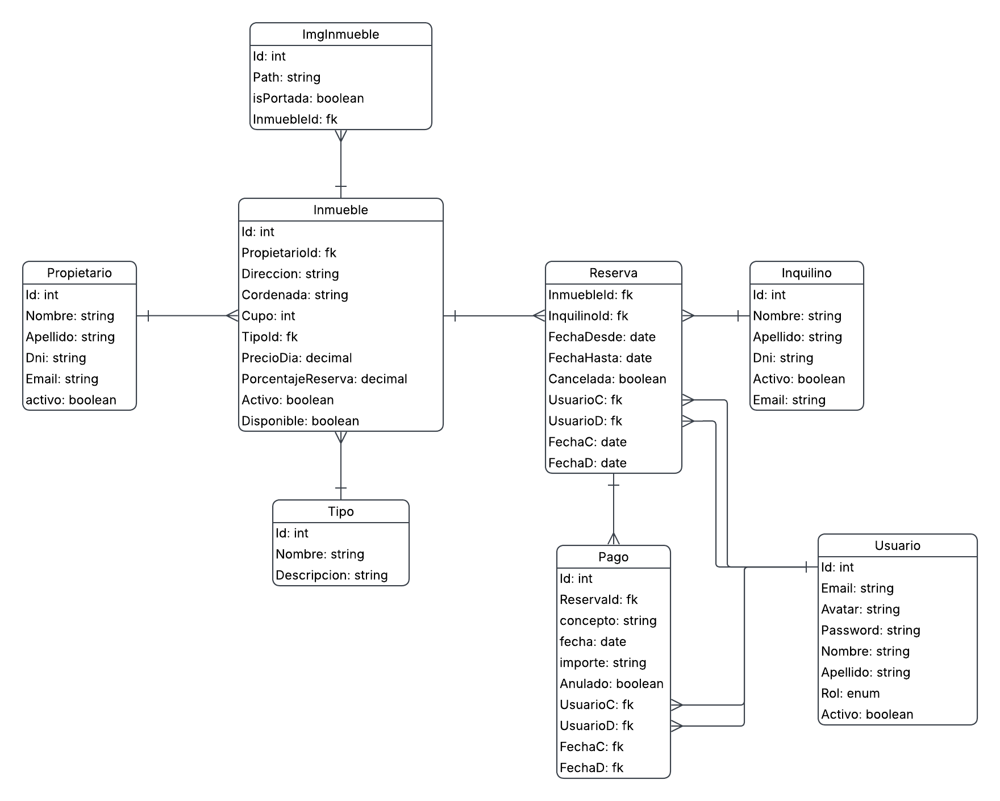

# Nombre del Proyecto

> Sistema de gestión inmobiliaria desarrollado con ASP.NET MVC, Entity Framework y MySQL Server.

---

## 👥 Integrantes del Grupo

- **Hernán Gonzalo Constante** - *hernanbonne98@gmail.com* - [@usuario_github](https://github.com/ElHernan14) - Discord: `usuario_discord`
- **Nicanor Arancibia** - *nikanor_95@hotmail.com* - [@usuario_github](https://github.com/Nicanor95) - Discord: `usuario_discord`
- **Kevin Paredes** - *kevinenriquep26@gmail.com* - [@usuario_github](https://github.com/kevinpa26) - Discord: `usuario_discord`

---

## 📐 Modelado de Datos

A continuación se presenta el esquema del modelo de datos correspondiente a la aplicación:

### Diagrama Entidad-Relación (DER) / Diagrama de Clases

